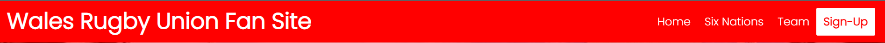
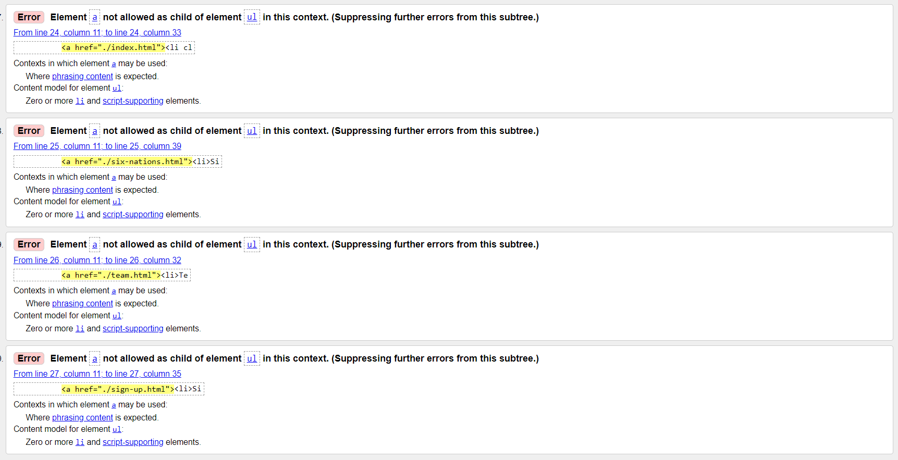
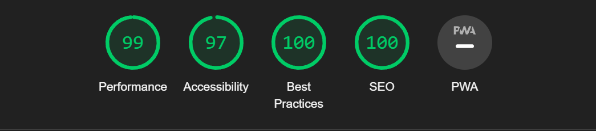
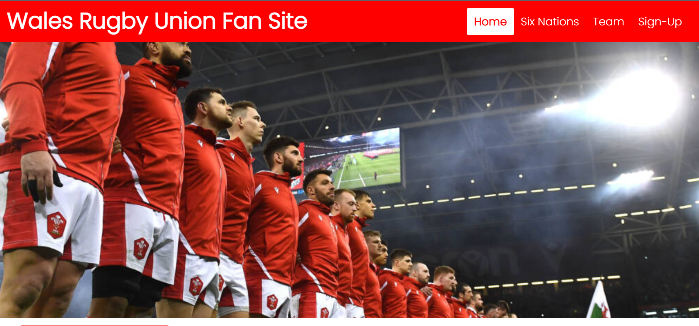
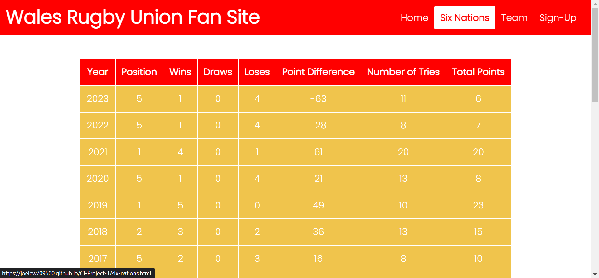
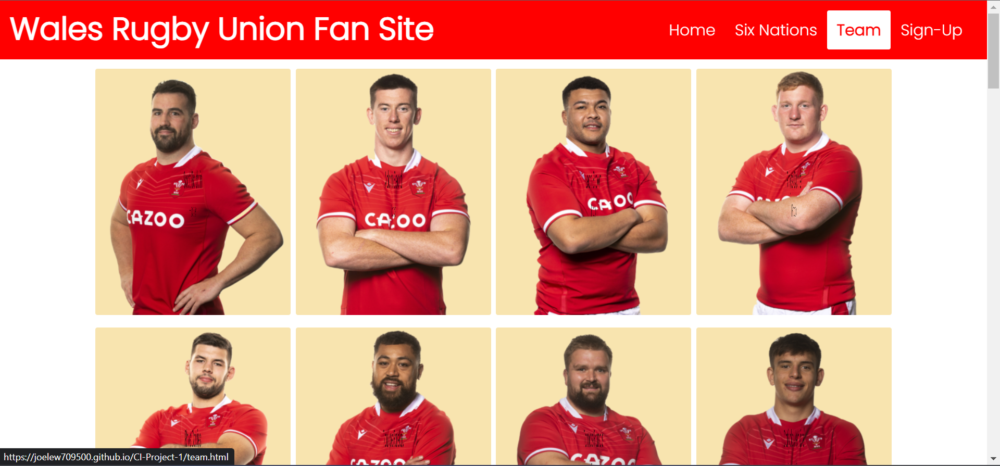
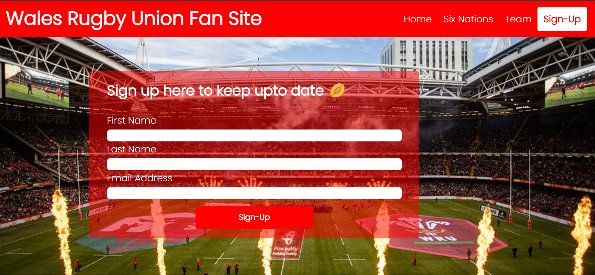

# Wales Rugby Union Fan Site

## Introduction

Well come to my first project for my Full Stack Diploma at Code Institute.

This website is a fan website of the National Rugby team of Wales.

Users of the site will be able to look at this site and see up to date six nation results, players and their positions.

A live website can be found [here](https://joelew709500.github.io/CI-Project-1/index.html).

## Table of Content

* [Features](#features)
    * [Header](#header)
    * [Home Page](#home-page)
    * [Six Nations](#six-nations)
    * [Team](#team)
    * [Sign-up](#sign-up)
* [Testing](#testing)
    * [Bugs](#bugs)
    * [Lighthouse Results](#lighthouse-results)
* [Deployment](#deployment)
* [Final product](#final-product)
* [Credits](#credits)
    * [Content](#content)
    * [Media](#media)

## Features
[Back to table of content](#table-of-content)

### Header
* At the top of the page the header consists of the website name and a navigation bar
* The navigation bar collapses into a dropdown menu once the width is 780px or below
* The theme is red as its the color of Wales and the jersey of the Wales rugby team
* The header has the sticky attribute to make it easier for users to navigate the website once scrolled

### Home Page
* Has the welsh team standing in a row ready to sing the national anthem before the game starts, just like the user is getting ready to use the site
* This is followed by the 3 feathers that zooms in with the summery text to its right or below if screen size is less than or equal to 780px
* This page shoes what the users are to expect from the page

### Six Nations
* Has a table of all of Wales's results from the Six Nations since the Five Nations became the Six Nations in 2000
* The table has a background colour that is the same as the crown of the 3 feathers and when you hover over each year the color changes to green which is one of the colours on the welsh flag this makes it easier for the user to read.
* When screen size is less than or equal to 780px the table headers abbreviate to the standard abbreviations shown on TV
* The information is put into a linear format making it easier for the user to read

### Team
* This page consists of every player in the welsh squad
* When hovering over the player the card flips and gives the players name and position this gives the user a more interactive experience

### Sign-up
* This form is to collect the information of fans if they chose to do so to keep up to date on the Welsh Rugby Team
* This will help the user keep up to date on the Wales Rugby Team

### Footer
* This consists of the social media links that open in a new tab
* The icons also enlarge when you hover over them for a more interactive user experience 

## Testing
[Back to table of content](#table-of-content)
* I've tested the website on Edge, Chrome, Firefox
* I've tested the websites screen sizing on chrome developer tools, Google Pixel 7 and Samsung Active Tab 3
* I can confirm that the sign-up form works and forces you to enter the correct information

### Bugs
* HTML
    * First time putting the HTML pages into W3C Validator I had errors for my navigation bar where I had the anchor element as the parent element of an unordered list element
        * Fix
            * Placed the anchor element as a child of the unordered list element
            * Changed the CSS to have the style apply to the unordered list element
    * On the sign-up page I also had an error for the attribute in a input element
        * Fix
            * To fix this I changed the attribute from require to required

* CSS
    * No errors showing on jigsaw validator

* Accessibility
    * I can confirm that the colours and fonts used are accessible and appropriate by running lighthouse in dev tools

#### Lighthouse results

Home 

Six nations

Team

Sign-up

* Unfixed Bugs
    * No unfixed bugs

### Manual Testing

#### Screen size greater than 780 px
##### Header

Feature | Desired Outcome | Pass / Fail
--- | --- | ---
Website logo/title | Takes you to index.html on hover back ground colour changes to white and text to red | Pass
Home button | Takes you to index.html on hover back ground colour changes to white and text to red | Pass
Six Nations button | Takes you to six-nations.html on hover back ground colour changes to white and text to red | Pass
Team button | Takes you to team.html on hover back ground colour changes to white and text to red | Pass
Sign-up button | Takes you to sign-up.html on hover back ground colour changes to white and text to red | Pass

#### Home Page
Feature | Desired Outcome | Pass / Fail
--- | --- | ---
Hero Image | On load image zooms in and increases in opacity | Pass
Three Feathers Image | On load image zooms in and increases in opacity | Pass

#### Six Nations Page
Feature | Desired Outcome | Pass / Fail
--- | --- | ---
Table | On hover background colour on row changes to green| Pass
Table Header | Sticks just below the header | Pass

#### Team Page
Feature | Desired Outcome | Pass / Fail
--- | --- | ---

## Deployment
[Back to table of content](#table-of-content)

I used GitHub pages to deploy my final project. To do this I had to:

1. Create a repository on GitHub.
2. Clone the repository on your chosen source code editor (VS code in my case) using the clone link.
3. Add files to Git.
4. Use git within VS code to push the code.
5. Go to GitHub
6. Select your repository.
7. Select settings.
8. Select pages on the left menu.
9. Click on the main branch.
10. This will generate a link with your website live.

## Final product

[Back to table of content](#table-of-content)

Please see screenshots of each page below

Home

Six Nations

Team

Sign-up

## Credits
[Back to table of content](#table-of-content)
### Content
* The code to make the flip cards in the teams page is from [Coding With Russ](https://www.youtube.com/watch?v=NCLdf661ILE&t=542s) 
### Media
All images on this site was taken from [WRU website](https://www.wru.wales/)